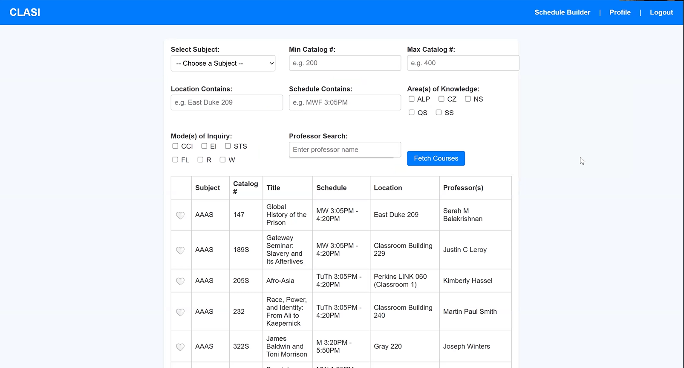

# Clasi

Keeping your semester course selection process simple — and Clasi.

## Overview

Each semester, Duke students navigate a complex and high-stakes course selection process. Balancing graduation requirements, GPA goals, professor preferences, and personal interests makes registration stressful—especially for first-year students.

**Clasi** simplifies that process by integrating official course data from Duke with additional insights from RateMyProfessor. Users can filter by academic codes (AOK, MOI), instructor ratings, difficulty, and more. Students can also leave reviews for specific classes and professors to help others make better decisions.



## Features

- Search courses by:
  - Area of Knowledge (AOK), Mode of Inquiry (MOI)
  - Department, professor, and time
  - RateMyProfessor rating and difficulty
- View reviews of specific course sections (e.g., CS201 with Prof. X)
- Submit your own reviews and ratings
- Save favorite courses for later
- Log in to personalize experience and contribute
- Schedule builder suggests non-conflicting classes by rating

## Setup

1. Clone the repository:
   ```bash
   git clone https://github.com/kanthipm/clasi.git
   cd clasi
   ```

2. Create and activate a virtual environment:
   ```bash
   python3 -m venv venv
   source venv/bin/activate
   ```

3. Install dependencies:
   ```bash
   pip install -r requirements.txt
   ```

4. Build the course database:
   ```bash
   python src/db.py
   ```

5. Launch the Flask app:
   ```bash
   python api_ui.py
   ```

## Technical Stack

- **Backend**: Flask, Python, SQLite
- **Frontend**: HTML/CSS (Jinja2)
- **Data**:
  - Duke Curriculum API
  - RateMyProfessor scraping (requests, BeautifulSoup)

